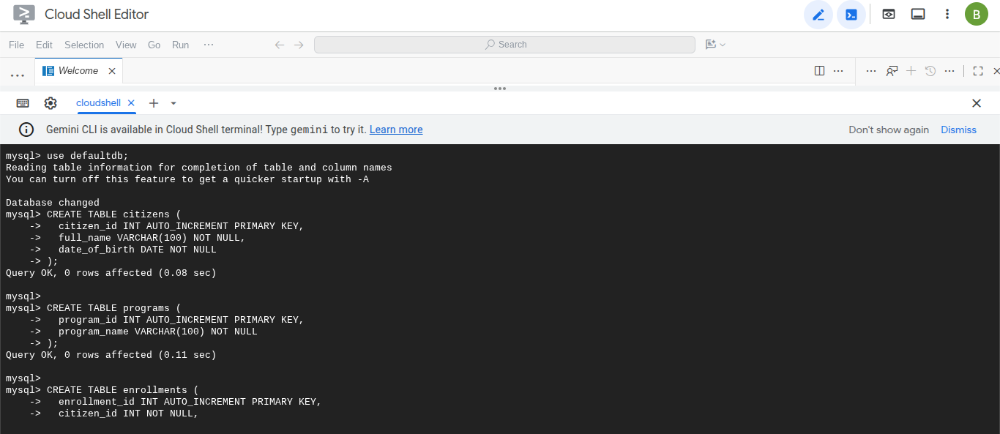
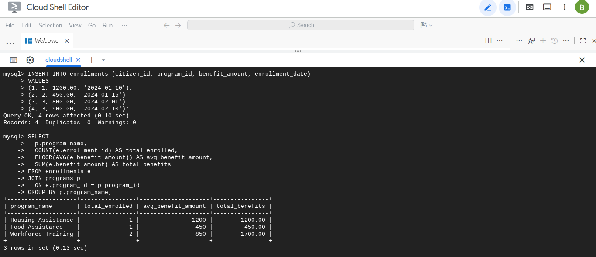

# Public Services Data Analysis (MySQL)

## Objective
Provide accurate summary reporting on participation and benefit distribution
across public assistance programs.

## Database
- MySQL 8.x (Avien Console)
- 3 normalized tables: citizens, programs, enrollments

## Business Questions Answered
- How many participants are enrolled per program?
- What is the average benefit amount per program?
- What is the total benefit distribution?

## SQL Techniques Used
- JOINs
- Aggregation (COUNT, AVG, SUM)
- FLOOR for government-style rounding
- Grouped reporting

## Validation
Queries were executed in a live MySQL environment.
Screenshots included for verification.

## Outcome
Produces clear, auditable metrics that support funding and program evaluation decisions.

<h2>Screenshots</h2>

<h3>Table Creation</h3>

<h3>Data Insertion</h3>

<h3>Core Analytic Query</h3>

